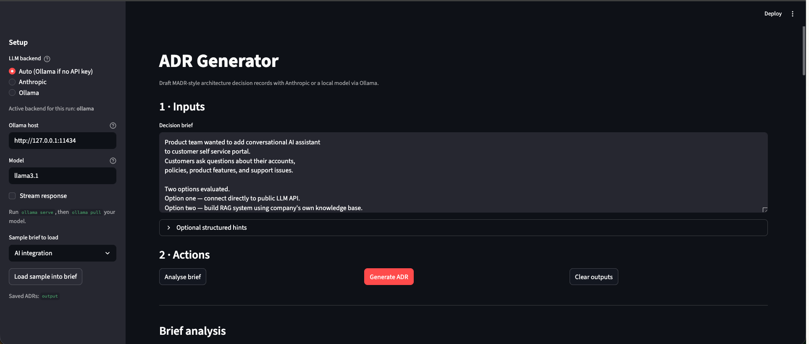
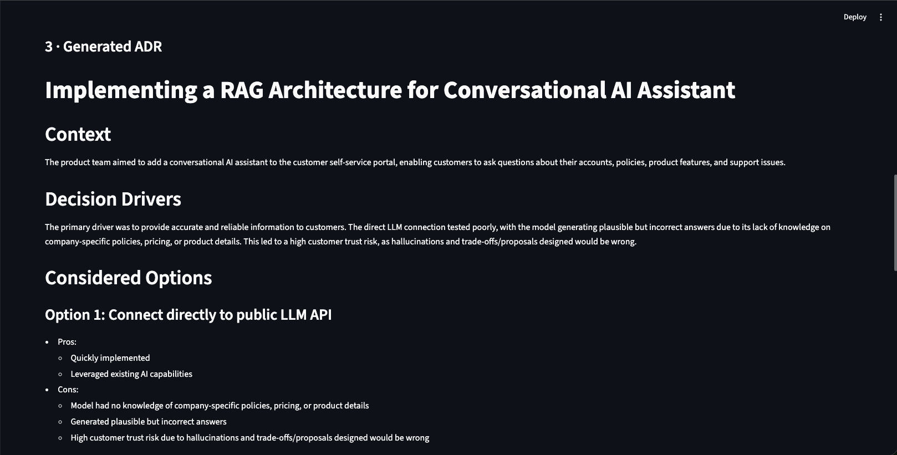
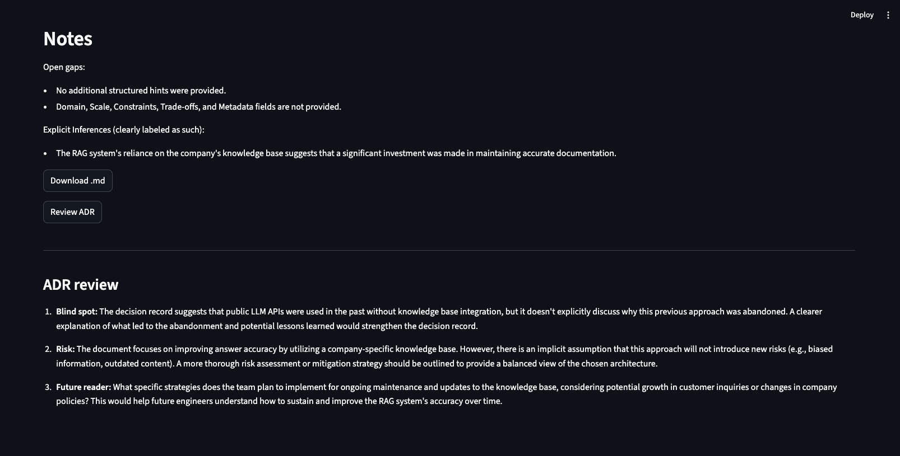

# ADR Generator

Small **Streamlit** app that turns a decision brief into **MADR-style** Markdown using **[Anthropic](https://www.anthropic.com/)** (cloud) and/or a **local model via [Ollama](https://ollama.com/)**.

### Problem that this solves

Every software system carries invisible decisions - accumulated reasoning behind hundreds of architectural design decisions made by people who may no longer be on the team. 

What if the reason isn't documented?
- Any new team member would not know why this architecture decision was taken? 
- Chance of creating the same mistakes again.
- Old decisions being done due to a reason, would get reverted without understanding its rationale and impacts.
- Architecture reviews become projects that are looking at why historically a decision was made, the focus would be on finding why rather than knowing.
- Technical debt would grow in case the decision was supposed to be revisited as a fast follow or tech debt.

"Architecture Decision Records" solve these problems. They make the invisible rationale, visible - capturing not just the decision but why, what was considered and rejected, how the decision was arrived.

In current state of fast adoption of technical stack and limited resource availability, drafting clear ADRs is omitted or not given a serious thought. It takes a great deal of discipline and time to draft a good ADR, which the teams rarely have time to do. 

This tool is created specifically to remove that friction and ease ADR creation. This becomes a notetaker application that can draft clean ADRs. The beauty of this tool is it relies on prompts as its base which can be enhanced and edited as per each architect's organization, constraints, technical stack and format of sample ADRs in the company.

You get a well structured ADR generated in seconds.

Why this exists is documented in [architecture/adr-001-why-we-built-this.md](architecture/adr-001-why-we-built-this.md).

## Prerequisites

- Python 3.12+ recommended
- **Anthropic:** an API key if you use the Anthropic backend or **Auto** with a key set.
- **Ollama:** install, run `ollama serve`, and `ollama pull <model>` (e.g. `llama3.2`) when using Ollama or **Auto** without a key.

## Setup

```bash
cd adr-generator
python -m venv .venv
source .venv/bin/activate   # Windows: .venv\Scripts\activate
pip install -r requirements.txt
cp .env.example .env
# Set ANTHROPIC_API_KEY and/or OLLAMA_* — see .env.example
```

## Run locally

```bash
streamlit run app.py
```

Open the URL Streamlit prints (default [http://localhost:8501](http://localhost:8501)).

### LLM backend (sidebar)

| Option | Behavior |
|--------|----------|
| **Auto (Ollama if no API key)** | Uses Anthropic when `ANTHROPIC_API_KEY` is set; otherwise **Ollama** (local). |
| **Anthropic** | Cloud only; requires `ANTHROPIC_API_KEY`. |
| **Ollama** | Local only; set **Ollama host** and **model** (e.g. `llama3.2`). |

## Examples

- **Default (tooling):** [examples/example-input.txt](examples/example-input.txt)
- **Healthcare:** [examples/industry-examples/input/healthcare-input-example.txt](examples/industry-examples/input/healthcare-input-example.txt)
- **AI integration:** [examples/industry-examples/input/ai-integration-example.txt](examples/industry-examples/input/ai-integration-example.txt)

## What this demonstrates?

### Prompt Engineering
This application uses three separate prompts working together:
- **Analyser** Prompt identifies what is the critical information that is missing from the notes/decision. It provides an opportunity for the architect to check out the decision reasons, stakeholders, missing information in a more deep fashion.
- **Generator** Prompt generates the ADR in seconds using the context, analyser input. It generates a MADR-inspired format from the notes and context.
- **Reviewer** Prompt acts as a reviewer and provide critique on the generated ADR, surfaces unconsidered alternatives and risks that are understated.

The quality of the output from this tool is dependent on the quality of the prompts, input, and most importantly context. The application provides a template to build such specialized tools that can generate ADRs. The application guides users to provide context - domain, scale, constraints  - rather than accepting a vague notes and generate a half-baked ADR document. 

### Context Design
AI models depend heavily on the context provided. Basically, they know what you tell them. 

The application structures input collection across 4 layers:
 - System Context - What kind of system, Which Domain, What is the scale?
 - Decision Context - What is the decision in specific language.
 - Constraints Context - What could be changed?
 - Outcome Context - What actually happened and what was the learning?

A richer context would provide a richer output.

### Local vs Cloud LLM
The automatic backend selector demonstrates enterprise architectural pattern, it would provide to select local vs a cloud LLM service to generate results. It is able to gracefully fallback in case cloud systems aren't available to a local model based on credentials and configuration.

This matters a lot in enterprise scale, where data security, integrity, confidentiality are a matter of concern. It also recognizes the backend would also bring in cost constraints for a tool that would generate these kind of documentation. Local Ollama can be used for the basic ADR generation.


Load any of these from the sidebar (“Sample brief to load” → **Load sample into brief**).

Illustrative MADR (human-written reference) for the default brief: [examples/example-output.md](examples/example-output.md).

**Generated ADRs** are also written to the `output/` folder each time you click **Generate ADR**.

## Project layout

| Path | Purpose |
|------|---------|
| `app.py` | Entry: `streamlit run app.py` → loads UI |
| `streamlit_app.py` | Streamlit layout and session wiring only |
| `adr_service.py` | Core logic: paths, save/load examples, LLM calls |
| `llm.py` | Anthropic + Ollama chat (complete + stream) |
| `prompts/` | Package: loads Markdown prompts from `prompts/*.md` at call time (`__init__.py`) |
| `prompts/system-prompt.md` | System prompt (MADR-inspired ADR output rules) |
| `prompts/generator-prompt.md` | User prompt for generation (placeholders filled in code) |
| `prompts/analyser-system-prompt.md` | System prompt for brief analysis |
| `prompts/analyser-prompt.md` | User prompt for pre-flight analysis |
| `prompts/reviewer-system-prompt.md` | System prompt for ADR review |
| `prompts/reviewer-prompt.md` | User prompt for ADR review |
| `requirements.txt` | Python dependencies |
| `examples/` | Sample briefs (default + `industry-examples/input/`) |
| `output/` | Copies of generated ADRs (created on generate; not committed) |
| `architecture/` | ADRs about this tool |

## Security

- Do not commit `.env` or real API keys.
- Ollama keeps generations on your machine; Anthropic sends prompts to Anthropic’s API.
- If you expose the Streamlit app beyond a trusted network, put it behind authentication or a VPN.

## Architectural Decisions for this Tool
The decisions made while building this application are documented as ADRs (I know!) in the `/architecture` folder - using the same format the tool would generate. 
[# ADR-001: Why we built this ADR generator] - (`architecture/adr-001-why-we-built-this.md`)

This allows the tool also to have a sample format that the ADR would be generated on. The user can modify this to their templates and formats. It also emphasizes that using ADRs to build an ADR tool is an architectural discipline, habit and not an afterthought.

## How was it built
This application was built using Cursor as an AI coding assistant. The architecture, prompt design, and problem framing were my own. I used AI tooling to accelerate the implementation - which in itself is consistent with the theme of the project.

## Screenshots
- 
- 
- 
- 